# Sistema de Comentarios por Alerta con Re-evaluación

## 📋 Resumen Ejecutivo

Este documento analiza cómo implementar un sistema de comentarios granulares en líneas específicas de código SQL dentro de Pull Requests de GitHub, con capacidad de re-evaluación automática cuando los desarrolladores responden a las alertas.

**Objetivo:** Mejorar la experiencia de revisión permitiendo comentarios contextuales en líneas específicas y re-análisis dirigido de alertas individuales.

---

## 🏗️ Análisis de Estructura Actual

### Estado Actual del Sistema

**Arquitectura existente:**
```typescript
// src/github/commenter.ts (línea 124-130)
async postComment(prNumber, results, runUrl, aiModel, modelVersion) {
  const comment = this.formatAnalysisComment(results, runUrl, aiModel, modelVersion);

  await this.octokit.issues.createComment({
    owner: this.owner,
    repo: this.repo,
    issue_number: prNumber,
    body: comment
  });
}
```

**Características actuales:**
- ✅ 3 modelos analizan en paralelo (Claude, GPT-5, Gemini)
- ✅ 3 comentarios separados por modelo
- ✅ Formato detallado con executive summary
- ✅ Categorización: critical, warnings, suggestions
- ✅ Good practices identificadas

**Limitaciones detectadas:**
- ❌ Usa `issues.createComment()` → comentarios generales en conversación PR
- ❌ Sin vinculación alerta → línea específica de código
- ❌ Sin persistencia de estado para re-evaluación
- ❌ Sin webhooks para detectar respuestas de desarrolladores
- ❌ Re-análisis completo o nada (no granular)
- ❌ UX: scroll largo para encontrar alerta específica

---

## 🔍 Comparación: Tipos de Comentarios en GitHub

### 1. Issue Comments (Actual)

**API utilizada actualmente:**
```typescript
await octokit.issues.createComment({
  owner: 'owner',
  repo: 'repo',
  issue_number: 123,
  body: 'Comentario completo del análisis'
});
```

**Características:**
- Comentario general en conversación del PR
- NO vinculado a línea específica
- NO parte de review formal
- Visible en pestaña "Conversation"
- NO permite comentarios en línea

**Cuándo usar:**
- Resumen ejecutivo general
- Alertas sin línea específica
- Métricas globales

### 2. Review Comments (Propuesto)

**API propuesta:**
```typescript
await octokit.pulls.createReviewComment({
  owner: 'owner',
  repo: 'repo',
  pull_number: 123,
  commit_id: 'sha256...',    // Commit específico
  path: 'sql/schema.sql',    // Archivo
  line: 42,                  // Línea específica
  side: 'RIGHT',             // Lado del diff
  body: '🚨 Critical: API key sin hash'
});
```

**Características:**
- ✅ Comentario en línea específica de código
- ✅ Vinculado a commit SHA
- ✅ Threaded responses (conversaciones)
- ✅ Visible en pestaña "Files changed"
- ✅ `comment_id` persistente para tracking
- ✅ Soporta replies con `in_reply_to_id`

**Cuándo usar:**
- Alertas critical/warning con línea conocida
- Issues específicos en sintaxis SQL
- Sugerencias de refactoring puntuales

### 3. Pull Request Reviews (Propuesto Batch)

**API más eficiente:**
```typescript
await octokit.pulls.createReview({
  owner: 'owner',
  repo: 'repo',
  pull_number: 123,
  commit_id: 'sha256...',
  event: 'COMMENT',        // o 'APPROVE'/'REQUEST_CHANGES'
  body: 'Review summary',  // Comentario general del review
  comments: [              // Array de comentarios en línea
    { path: 'sql/schema.sql', line: 42, body: 'Alert 1' },
    { path: 'sql/users.sql', line: 15, body: 'Alert 2' },
    { path: 'sql/orders.sql', line: 88, body: 'Alert 3' }
  ]
});
```

**Características:**
- ✅ Batch: múltiples comentarios en 1 API call
- ✅ Agrupa comentarios bajo 1 review
- ✅ Más eficiente para rate limits
- ✅ Review puede tener estado (COMMENT/APPROVE/REQUEST_CHANGES)
- ✅ Máximo 30 comentarios por review

**Cuándo usar:**
- Múltiples alertas en el mismo análisis
- Optimización de rate limits
- Review formal con aprobación/rechazo

---

## 🎯 Arquitectura Propuesta

### Componentes Nuevos

```
src/
├── github/
│   ├── review-commenter.ts       # Gestión de review comments
│   ├── metadata-store.ts         # Persistencia de metadata en Gist
│   └── commenter.ts              # Mantener para summary general
├── reevaluate.ts                 # Script de re-evaluación
└── index.ts                      # Modificar flujo principal

.github/workflows/
├── sql-review.yml                # Modificar: usar review comments
└── reevaluate-alert.yml          # Nuevo: listener de webhooks
```

### Flujo de Datos

```mermaid
sequenceDiagram
    participant Dev as Developer
    participant GH as GitHub
    participant Action as GitHub Action
    participant Bot as SQL Agent Bot
    participant Gist as Gist Storage

    Dev->>GH: Create PR with SQL changes
    GH->>Action: Trigger sql-review.yml
    Action->>Bot: Analyze SQL files
    Bot->>Bot: Run 3 AI models in parallel

    loop For each alert with line number
        Bot->>GH: createReview() with comments batch
        GH-->>Bot: Return comment_id
        Bot->>Gist: Store comment_id → alert mapping
    end

    Bot->>GH: Post summary comment with gist_id

    Dev->>GH: Reply to review comment
    GH->>Action: Webhook: pull_request_review_comment
    Action->>Gist: Load metadata by gist_id
    Gist-->>Action: Return alert data
    Action->>Bot: Re-evaluate specific alert
    Bot->>Bot: Re-analyze SQL file
    Bot->>GH: Update review comment (resolved/persists)
    Bot->>Gist: Update last_evaluated timestamp
```



---

## 💾 Gestión de Estado y Persistencia

### Problema: GitHub Actions es Stateless

GitHub Actions no mantiene estado entre ejecuciones. Para re-evaluación necesitamos persistir:

```typescript
interface CommentMetadata {
  comment_id: number;           // ID del comentario en GitHub
  pr_number: number;
  repository: string;
  alert: {
    type: 'critical' | 'warning' | 'suggestion';
    file: string;               // sql/schema.sql
    line: number;               // Línea en archivo
    ai_model: string;           // claude-sonnet-4-5-20250929
    original_analysis: {        // Análisis original completo
      issue: string;
      risk: string;
      fix: string;
      table?: string;
      location?: string;
      present_in_file: boolean;
      confidence: number;
    };
  };
  created_at: string;           // ISO timestamp
  last_evaluated: string;       // ISO timestamp
  status: 'pending' | 'resolved' | 'persists';
}
```

### Opción A: Gist Privado (Recomendada para MVP)

**Ventajas:**
- ✅ API nativa de GitHub (Octokit)
- ✅ Sin infraestructura adicional
- ✅ Privado por defecto
- ✅ Control de versiones automático
- ✅ Fácil de implementar

**Desventajas:**
- ❌ Límite 10MB por archivo
- ❌ No ACID (race conditions posibles)
- ❌ No queries complejas
- ❌ Performance degrada con muchos registros

**Implementación:**

```typescript
// src/github/metadata-store.ts
import { Octokit } from '@octokit/rest';

export class MetadataStore {
  private octokit: Octokit;

  constructor(githubToken: string) {
    this.octokit = new Octokit({ auth: githubToken });
  }

  /**
   * Guarda metadata de análisis en Gist privado
   * Retorna gist_id para referencia
   */
  async saveMetadata(
    prNumber: number,
    repository: string,
    metadata: Map<number, CommentMetadata>
  ): Promise<string> {
    const content = JSON.stringify(
      Object.fromEntries(metadata),
      null,
      2
    );

    const { data: gist } = await this.octokit.gists.create({
      files: {
        [`pr-${prNumber}-metadata.json`]: {
          content
        }
      },
      description: `SQL Analysis Metadata for ${repository}#${prNumber}`,
      public: false
    });

    console.log(`✅ Metadata saved to Gist: ${gist.id}`);
    return gist.id;
  }

  /**
   * Carga metadata desde Gist
   */
  async loadMetadata(gistId: string): Promise<Map<number, CommentMetadata>> {
    const { data: gist } = await this.octokit.gists.get({
      gist_id: gistId
    });

    const filename = Object.keys(gist.files)[0];
    const content = gist.files[filename]?.content;

    if (!content) {
      throw new Error(`No content found in gist ${gistId}`);
    }

    const obj = JSON.parse(content);

    return new Map(
      Object.entries(obj).map(([k, v]) =>
        [parseInt(k), v as CommentMetadata]
      )
    );
  }

  /**
   * Actualiza metadata de un comentario específico
   */
  async updateMetadata(
    gistId: string,
    commentId: number,
    updates: Partial<CommentMetadata>
  ): Promise<void> {
    const metadata = await this.loadMetadata(gistId);
    const existing = metadata.get(commentId);

    if (!existing) {
      throw new Error(`Comment ${commentId} not found in metadata`);
    }

    metadata.set(commentId, { ...existing, ...updates });

    // Re-guardar todo el gist
    const content = JSON.stringify(
      Object.fromEntries(metadata),
      null,
      2
    );

    await this.octokit.gists.update({
      gist_id: gistId,
      files: {
        [`pr-${existing.pr_number}-metadata.json`]: {
          content
        }
      }
    });

    console.log(`✅ Updated metadata for comment ${commentId}`);
  }

  /**
   * Busca metadata por comment_id específico
   */
  async getCommentMetadata(
    gistId: string,
    commentId: number
  ): Promise<CommentMetadata | undefined> {
    const metadata = await this.loadMetadata(gistId);
    return metadata.get(commentId);
  }
}
```

**Formato Gist:**
```json
{
  "123456": {
    "comment_id": 123456,
    "pr_number": 45,
    "repository": "owner/repo",
    "alert": {
      "type": "critical",
      "file": "sql/schema.sql",
      "line": 42,
      "ai_model": "claude-sonnet-4-5-20250929",
      "original_analysis": {
        "issue": "Inbound API key sin hash",
        "risk": "Exposición de credenciales",
        "fix": "ALTER TABLE ...",
        "table": "user_api_keys",
        "present_in_file": true,
        "confidence": 100
      }
    },
    "created_at": "2025-10-30T10:00:00Z",
    "last_evaluated": "2025-10-30T10:00:00Z",
    "status": "pending"
  },
  "123457": {
    ...
  }
}
```

### Opción B: Supabase Database (Producción)

**Ventajas:**
- ✅ ACID compliant
- ✅ Queries SQL complejas
- ✅ Escalabilidad ilimitada
- ✅ Triggers y funciones
- ✅ Tiempo real

**Desventajas:**
- ❌ Infraestructura adicional
- ❌ Costos hosting
- ❌ Complejidad setup

**Schema:**
```sql
CREATE TABLE comment_metadata (
  comment_id BIGINT PRIMARY KEY,
  pr_number INT NOT NULL,
  repository TEXT NOT NULL,
  alert_type TEXT CHECK (alert_type IN ('critical', 'warning', 'suggestion')),
  file_path TEXT NOT NULL,
  line_number INT NOT NULL,
  ai_model TEXT NOT NULL,
  original_analysis JSONB NOT NULL,
  created_at TIMESTAMPTZ DEFAULT now(),
  last_evaluated TIMESTAMPTZ DEFAULT now(),
  status TEXT DEFAULT 'pending' CHECK (status IN ('pending', 'resolved', 'persists')),

  INDEX idx_pr_number (pr_number),
  INDEX idx_repository (repository),
  INDEX idx_status (status)
);

CREATE TABLE reevaluation_history (
  id UUID PRIMARY KEY DEFAULT gen_random_uuid(),
  comment_id BIGINT REFERENCES comment_metadata(comment_id),
  evaluated_at TIMESTAMPTZ DEFAULT now(),
  result TEXT CHECK (result IN ('resolved', 'persists', 'error')),
  details JSONB
);
```

---

## 🔄 Flujo Detallado: Análisis Inicial

### Paso 1: Detección de Cambios

```typescript
// src/index.ts (mantener igual)
const prHandler = new PRHandler(config.githubToken, owner, repo);
const changedFiles = await prHandler.getChangedSQLFiles(config.prNumber);

// Obtener commit SHA más reciente
const { data: pr } = await octokit.pulls.get({
  owner,
  repo,
  pull_number: config.prNumber
});
const commitId = pr.head.sha;  // Necesario para review comments
```

### Paso 2: Análisis Multi-Modelo

```typescript
// src/index.ts (mantener igual)
const [anthropicResults, openaiResults, geminiResults] = await Promise.all([
  anthropicAnalyzer.analyzeMultipleFiles(filesToAnalyze),
  openaiAnalyzer.analyzeMultipleFiles(filesToAnalyze),
  geminiAnalyzer.analyzeMultipleFiles(filesToAnalyze)
]);
```

### Paso 3: Creación de Review Comments

```typescript
// src/github/review-commenter.ts
export class ReviewCommenter {
  private octokit: Octokit;
  private owner: string;
  private repo: string;

  constructor(githubToken: string, owner: string, repo: string) {
    this.octokit = new Octokit({ auth: githubToken });
    this.owner = owner;
    this.repo = repo;
  }

  /**
   * Crea review comments en batch (máx 30 por review)
   * Retorna Map de (file:line) → comment_id
   */
  async postAlertsAsReview(
    prNumber: number,
    commitId: string,
    alerts: Array<{
      file: string;
      line: number;
      alert: CriticalIssue | Warning | Suggestion;
      type: 'critical' | 'warning' | 'suggestion';
      aiModel: string;
    }>
  ): Promise<Map<string, number>> {
    const BATCH_SIZE = 30;  // Límite GitHub API
    const mapping = new Map<string, number>();

    for (let i = 0; i < alerts.length; i += BATCH_SIZE) {
      const batch = alerts.slice(i, i + BATCH_SIZE);

      const { data: review } = await this.octokit.pulls.createReview({
        owner: this.owner,
        repo: this.repo,
        pull_number: prNumber,
        commit_id: commitId,
        event: 'COMMENT',
        body: i === 0 ? this.formatReviewSummary(alerts, aiModel) : undefined,
        comments: batch.map(({ file, line, alert, type }) => ({
          path: file,
          line,
          body: this.formatAlert(alert, type)
        }))
      });

      // Mapear alerts → comment IDs
      review.comments?.forEach((comment, idx) => {
        const original = batch[idx];
        const key = `${original.file}:${original.line}`;
        mapping.set(key, comment.id);
      });

      console.log(`✅ Created review batch ${i / BATCH_SIZE + 1} with ${batch.length} comments`);
    }

    return mapping;
  }

  private formatAlert(
    alert: CriticalIssue | Warning | Suggestion,
    type: 'critical' | 'warning' | 'suggestion'
  ): string {
    const icon = type === 'critical' ? '🚨' : type === 'warning' ? '⚠️' : 'ℹ️';
    const title = type === 'critical' ? 'Critical Issue' :
                  type === 'warning' ? 'Warning' : 'Suggestion';

    let body = `### ${icon} ${title}\n\n`;

    if ('issue' in alert) {
      body += `**Problem:** ${alert.issue}\n`;
      body += `**Risk:** ${alert.risk}\n\n`;
    } else if ('suggestion' in alert) {
      body += `**Suggestion:** ${alert.suggestion}\n`;
      body += `**Benefit:** ${alert.benefit}\n\n`;
    }

    if (alert.fix) {
      body += `**Suggested Fix:**\n\`\`\`sql\n${alert.fix}\n\`\`\`\n\n`;
    }

    if ('table' in alert && alert.table) {
      body += `**Table:** \`${alert.table}\`\n`;
    }

    if ('location' in alert && alert.location) {
      body += `**Location:** \`${alert.location}\`\n`;
    }

    if ('confidence' in alert && alert.confidence !== undefined) {
      body += `**Confidence:** ${alert.confidence}%\n`;
    }

    body += `\n---\n`;
    body += `💬 **Reply to this comment to trigger re-evaluation**\n`;
    body += `🔄 Last checked: ${new Date().toISOString()}`;

    return body;
  }

  private formatReviewSummary(alerts: any[], aiModel: string): string {
    const critical = alerts.filter(a => a.type === 'critical').length;
    const warnings = alerts.filter(a => a.type === 'warning').length;
    const suggestions = alerts.filter(a => a.type === 'suggestion').length;

    return `## 🔍 SQL Analysis by ${aiModel}

**Summary:**
- 🚨 ${critical} Critical Issues
- ⚠️ ${warnings} Warnings
- ℹ️ ${suggestions} Suggestions

Each alert is commented on the specific line. Reply to any comment to trigger re-evaluation.`;
  }

  /**
   * Actualiza un review comment existente
   */
  async updateReviewComment(
    commentId: number,
    status: 'resolved' | 'persists',
    newAnalysis?: any
  ): Promise<void> {
    const { data: comment } = await this.octokit.pulls.getReviewComment({
      owner: this.owner,
      repo: this.repo,
      comment_id: commentId
    });

    let updatedBody = comment.body;

    if (status === 'resolved') {
      updatedBody = `~~${comment.body}~~\n\n✅ **Re-evaluated:** Issue resolved!\n\n*Last checked: ${new Date().toISOString()}*`;
    } else if (status === 'persists' && newAnalysis) {
      updatedBody = `${comment.body}\n\n⚠️ **Re-evaluated:** Issue still present\n\n${this.formatAlert(newAnalysis, 'warning')}\n\n*Last checked: ${new Date().toISOString()}*`;
    }

    await this.octokit.pulls.updateReviewComment({
      owner: this.owner,
      repo: this.repo,
      comment_id: commentId,
      body: updatedBody
    });

    console.log(`✅ Updated comment ${commentId} with status: ${status}`);
  }
}
```

### Paso 4: Construcción de Metadata

```typescript
// src/index.ts (modificar)
const reviewCommenter = new ReviewCommenter(config.githubToken, owner, repo);
const metadataStore = new MetadataStore(config.githubToken);

// Recolectar alertas de todos los modelos
const allAlerts: Array<{
  file: string;
  line: number;
  alert: CriticalIssue | Warning | Suggestion;
  type: 'critical' | 'warning' | 'suggestion';
  aiModel: string;
}> = [];

// Claude
for (const [filename, result] of anthropicResults) {
  result.critical.forEach(c => {
    if (c.line) {
      allAlerts.push({
        file: filename,
        line: c.line,
        alert: c,
        type: 'critical',
        aiModel: 'claude-sonnet-4-5-20250929'
      });
    }
  });
  result.warnings.forEach(w => {
    if (w.line) {
      allAlerts.push({
        file: filename,
        line: w.line,
        alert: w,
        type: 'warning',
        aiModel: 'claude-sonnet-4-5-20250929'
      });
    }
  });
  // Repetir para suggestions...
}

// Repetir para OpenAI y Gemini...

// Crear review comments
const commentIdMap = await reviewCommenter.postAlertsAsReview(
  config.prNumber,
  commitId,
  allAlerts
);

// Construir metadata
const metadata = new Map<number, CommentMetadata>();

for (const [key, commentId] of commentIdMap) {
  const [file, lineStr] = key.split(':');
  const line = parseInt(lineStr);

  const alert = allAlerts.find(a =>
    a.file === file && a.line === line
  );

  if (alert) {
    metadata.set(commentId, {
      comment_id: commentId,
      pr_number: config.prNumber,
      repository: config.repository,
      alert: {
        type: alert.type,
        file: alert.file,
        line: alert.line,
        ai_model: alert.aiModel,
        original_analysis: alert.alert
      },
      created_at: new Date().toISOString(),
      last_evaluated: new Date().toISOString(),
      status: 'pending'
    });
  }
}

// Persistir metadata
const gistId = await metadataStore.saveMetadata(
  config.prNumber,
  config.repository,
  metadata
);

console.log(`✅ Metadata saved to Gist: ${gistId}`);
```

### Paso 5: Comentario Summary con Referencia

```typescript
// Mantener comentario general con link a metadata
await commenter.postComment(
  config.prNumber,
  anthropicResults,
  runUrl,
  'Claude Sonnet 4.5',
  'claude-sonnet-4-5-20250929',
  gistId  // Nuevo parámetro
);

// Modificar formatAnalysisComment() en commenter.ts:
formatAnalysisComment(..., gistId?: string): string {
  let comment = `## 🔍 Supabase SQL Schema Analysis\n\n`;

  // ... contenido existente ...

  if (gistId) {
    comment += `\n\n---\n\n`;
    comment += `📋 **Review Comments Metadata:** [View Gist](https://gist.github.com/${gistId})\n`;
    comment += `<!-- METADATA_GIST_ID: ${gistId} -->`;
  }

  return comment;
}
```

---

## 🔁 Flujo Detallado: Re-evaluación

### Paso 1: Webhook Listener

```yaml
# .github/workflows/reevaluate-alert.yml
name: Re-evaluate SQL Alert

on:
  pull_request_review_comment:
    types: [created]

jobs:
  reevaluate:
    runs-on: ubuntu-latest

    permissions:
      contents: read
      pull-requests: write

    steps:
      - name: Checkout code
        uses: actions/checkout@v4

      - name: Setup Node.js
        uses: actions/setup-node@v4
        with:
          node-version: '20'
          cache: 'npm'

      - name: Install dependencies
        run: npm ci

      - name: Build TypeScript
        run: npm run build

      - name: Check if reply to bot
        id: check
        uses: actions/github-script@v7
        with:
          script: |
            const comment = context.payload.comment;

            // Verificar si es respuesta a comentario del bot
            if (!comment.in_reply_to_id) {
              console.log('Not a reply to another comment');
              core.setOutput('should_reevaluate', 'false');
              return;
            }

            // Buscar metadata en comentarios del PR
            const { data: comments } = await github.rest.issues.listComments({
              owner: context.repo.owner,
              repo: context.repo.repo,
              issue_number: context.payload.pull_request.number
            });

            const botComment = comments.find(c =>
              c.user.type === 'Bot' &&
              c.body.includes('<!-- METADATA_GIST_ID:')
            );

            if (!botComment) {
              console.log('No metadata comment found');
              core.setOutput('should_reevaluate', 'false');
              return;
            }

            const gistMatch = botComment.body.match(/<!-- METADATA_GIST_ID: (\w+) -->/);
            if (!gistMatch) {
              console.log('No gist ID found in metadata comment');
              core.setOutput('should_reevaluate', 'false');
              return;
            }

            core.setOutput('gist_id', gistMatch[1]);
            core.setOutput('comment_id', comment.in_reply_to_id);
            core.setOutput('pr_number', context.payload.pull_request.number);
            core.setOutput('should_reevaluate', 'true');

      - name: Re-evaluate alert
        if: steps.check.outputs.should_reevaluate == 'true'
        run: npm run reevaluate
        env:
          GITHUB_TOKEN: ${{ secrets.GITHUB_TOKEN }}
          ANTHROPIC_API_KEY: ${{ secrets.ANTHROPIC_API_KEY }}
          OPENAI_API_KEY: ${{ secrets.OPENAI_API_KEY }}
          GEMINI_API_KEY: ${{ secrets.GEMINI_API_KEY }}
          GITHUB_REPOSITORY: ${{ github.repository }}
          GIST_ID: ${{ steps.check.outputs.gist_id }}
          COMMENT_ID: ${{ steps.check.outputs.comment_id }}
          PR_NUMBER: ${{ steps.check.outputs.pr_number }}
```

### Paso 2: Script de Re-evaluación

```typescript
// src/reevaluate.ts
import { SQLAnalyzer } from './agent/analyzer.js';
import { OpenAIAnalyzer } from './agent/openai-analyzer.js';
import { GeminiAnalyzer } from './agent/gemini-analyzer.js';
import { MetadataStore } from './github/metadata-store.js';
import { ReviewCommenter } from './github/review-commenter.js';
import { SQLReader } from './parser/sql-reader.js';
import { Octokit } from '@octokit/rest';

async function reevaluateAlert() {
  console.log('🔄 Starting alert re-evaluation...');

  // Cargar configuración
  const githubToken = process.env.GITHUB_TOKEN!;
  const gistId = process.env.GIST_ID!;
  const commentId = parseInt(process.env.COMMENT_ID!);
  const prNumber = parseInt(process.env.PR_NUMBER!);
  const repository = process.env.GITHUB_REPOSITORY!;
  const [owner, repo] = repository.split('/');

  // Inicializar componentes
  const metadataStore = new MetadataStore(githubToken);
  const reviewCommenter = new ReviewCommenter(githubToken, owner, repo);
  const sqlReader = new SQLReader('sql');

  try {
    // 1. Cargar metadata del comentario
    console.log(`📋 Loading metadata for comment ${commentId}...`);
    const alertMeta = await metadataStore.getCommentMetadata(gistId, commentId);

    if (!alertMeta) {
      console.log('❌ No metadata found for this comment');
      return;
    }

    console.log(`✅ Found alert: ${alertMeta.alert.type} in ${alertMeta.alert.file}:${alertMeta.alert.line}`);

    // 2. Re-leer archivo SQL
    console.log(`📖 Reading SQL file: ${alertMeta.alert.file}`);
    const filename = alertMeta.alert.file.replace('sql/', '');
    const files = await sqlReader.readMultipleSQLFiles([filename]);

    if (files.length === 0) {
      console.log('❌ File not found or removed');
      return;
    }

    const sqlContent = files[0].content;

    // 3. Re-analizar con el modelo original
    console.log(`🔍 Re-analyzing with ${alertMeta.alert.ai_model}...`);

    let newResult;
    if (alertMeta.alert.ai_model.includes('claude')) {
      const analyzer = new SQLAnalyzer(process.env.ANTHROPIC_API_KEY!);
      newResult = await analyzer.analyzeSQLFile(sqlContent, alertMeta.alert.file);
    } else if (alertMeta.alert.ai_model.includes('gpt')) {
      const analyzer = new OpenAIAnalyzer(process.env.OPENAI_API_KEY!);
      newResult = await analyzer.analyzeSQLFile(sqlContent, alertMeta.alert.file);
    } else if (alertMeta.alert.ai_model.includes('gemini')) {
      const analyzer = new GeminiAnalyzer(process.env.GEMINI_API_KEY!);
      newResult = await analyzer.analyzeSQLFile(sqlContent, alertMeta.alert.file);
    } else {
      throw new Error(`Unknown AI model: ${alertMeta.alert.ai_model}`);
    }

    // 4. Buscar si la alerta específica sigue existiendo
    console.log('🔎 Checking if alert still exists...');

    const allIssues = [
      ...newResult.critical,
      ...newResult.warnings,
      ...newResult.suggestions
    ];

    const originalIssue = alertMeta.alert.original_analysis.issue;
    const stillExists = allIssues.some(issue =>
      issue.line === alertMeta.alert.line &&
      issue.issue.toLowerCase().includes(originalIssue.toLowerCase().substring(0, 20))
    );

    // 5. Actualizar comentario según resultado
    if (stillExists) {
      console.log('⚠️ Alert still present');
      await reviewCommenter.updateReviewComment(
        commentId,
        'persists',
        allIssues.find(i => i.line === alertMeta.alert.line)
      );

      await metadataStore.updateMetadata(gistId, commentId, {
        last_evaluated: new Date().toISOString(),
        status: 'persists'
      });
    } else {
      console.log('✅ Alert resolved!');
      await reviewCommenter.updateReviewComment(
        commentId,
        'resolved'
      );

      await metadataStore.updateMetadata(gistId, commentId, {
        last_evaluated: new Date().toISOString(),
        status: 'resolved'
      });
    }

    console.log('✨ Re-evaluation complete!');

  } catch (error) {
    console.error('❌ Error during re-evaluation:', error);
    throw error;
  }
}

// Ejecutar si se llama directamente
if (import.meta.url === `file://${process.argv[1]}`) {
  reevaluateAlert();
}

export { reevaluateAlert };
```

### Paso 3: Script npm

```json
// package.json (agregar)
{
  "scripts": {
    "build": "tsc",
    "start": "node dist/index.js",
    "reevaluate": "node dist/reevaluate.js"
  }
}
```

---

## ⚡ Rate Limits y Optimizaciones

### Límites GitHub API

**Con `GITHUB_TOKEN` (GitHub Actions):**
- **1,000 requests/hora** por repositorio
- Cada review comment cuenta como 1 request
- `createReview()` batch cuenta como 1 request (¡óptimo!)

**Estrategia de optimización:**

```typescript
// ❌ INEFICIENTE: 1 API call por alerta
for (const alert of alerts) {
  await createReviewComment({
    path: alert.file,
    line: alert.line,
    body: alert.body
  });  // N llamadas (consume N requests)
}

// ✅ EFICIENTE: 1 API call para hasta 30 alertas
await createReview({
  comments: alerts.slice(0, 30).map(a => ({
    path: a.file,
    line: a.line,
    body: a.body
  }))
});  // 1 llamada (consume 1 request)
```

**Batch processing:**

```typescript
const BATCH_SIZE = 30;  // Límite impuesto por GitHub API

async function createReviewsInBatches(alerts) {
  const batches = [];

  for (let i = 0; i < alerts.length; i += BATCH_SIZE) {
    batches.push(alerts.slice(i, i + BATCH_SIZE));
  }

  for (const [index, batch] of batches.entries()) {
    console.log(`Creating review batch ${index + 1}/${batches.length}`);

    await octokit.pulls.createReview({
      owner, repo, pull_number: prNumber,
      commit_id: commitId,
      event: 'COMMENT',
      body: index === 0 ? 'SQL Analysis Results' : undefined,
      comments: batch.map(...)
    });

    // Opcional: delay entre batches para evitar throttling
    if (index < batches.length - 1) {
      await sleep(1000);  // 1 segundo
    }
  }
}
```

### Monitoreo de Rate Limits

```typescript
async function checkRateLimit(octokit: Octokit) {
  const { data: rateLimit } = await octokit.rateLimit.get();

  console.log(`Rate Limit Status:
    Remaining: ${rateLimit.rate.remaining}/${rateLimit.rate.limit}
    Resets at: ${new Date(rateLimit.rate.reset * 1000).toISOString()}
  `);

  if (rateLimit.rate.remaining < 100) {
    console.warn('⚠️ Low rate limit remaining!');
  }
}
```

---

## 🚧 Desafíos Técnicos y Soluciones

### 1. Position vs Line en Diff

**Problema:** GitHub API tiene 2 sistemas de coordenadas:

```typescript
// Sistema 1: Line (simple, para single-line comments)
{
  line: 42,        // Línea absoluta en archivo
  side: 'RIGHT'    // Lado del diff
}

// Sistema 2: Position (complejo, para multi-line)
{
  position: 8      // Línea 8 en el DIFF, no en archivo
}
```

**Solución:** Usar `line` + `commit_id` (más simple):

```typescript
await octokit.pulls.createReviewComment({
  owner, repo, pull_number,
  commit_id: pr.head.sha,  // ← Requerido cuando usas 'line'
  path: 'sql/schema.sql',
  line: 42,                // ← Línea absoluta
  side: 'RIGHT',
  body: 'Comment'
});
```

### 2. Comments en Líneas No Modificadas

**Problema:** Review comments solo funcionan en líneas presentes en el diff.

**Escenario:**
```sql
-- Línea 10 (no modificada)
CREATE TABLE users (id UUID);

-- Línea 15 (modificada)
CREATE TABLE orders (tenant_id UUID);  -- ← Agregado
```

Si alerta está en línea 10 pero PR solo modificó línea 15, el comment fallará con error `line is not in diff`.

**Solución:**

```typescript
async function tryCreateReviewComment(commentData) {
  try {
    await octokit.pulls.createReviewComment(commentData);
  } catch (error) {
    if (error.message.includes('line is not in diff')) {
      console.log(`⚠️ Line ${commentData.line} not in diff, creating issue comment instead`);

      // Fallback: comentario general con referencia a línea
      await octokit.issues.createComment({
        owner, repo, issue_number: prNumber,
        body: `📍 **${commentData.path}:${commentData.line}**\n\n${commentData.body}`
      });
    } else {
      throw error;
    }
  }
}
```

### 3. Diff Drift (Commits Posteriores)

**Problema:** Si PR se actualiza con nuevos commits después del análisis, las líneas cambian.

**Escenario:**
```
Commit 1: Análisis en SHA abc123
  - Alerta en línea 42

Commit 2: Dev agrega código, SHA def456
  - Alerta ahora está en línea 50
  - Comentario queda en SHA abc123 línea 42 (outdated)
```

**Solución 1: Re-análisis en cada push**

```yaml
# sql-review.yml
on:
  pull_request:
    types: [opened, synchronize]  # ← synchronize = nuevo push
    paths:
      - 'sql/**/*.sql'
```

**Solución 2: Resolución automática de outdated**

```typescript
async function resolveOutdatedComments(prNumber) {
  const { data: comments } = await octokit.pulls.listReviewComments({
    owner, repo, pull_number: prNumber
  });

  const outdatedComments = comments.filter(c =>
    c.user.type === 'Bot' &&
    c.outdated === true
  );

  for (const comment of outdatedComments) {
    await octokit.pulls.updateReviewComment({
      owner, repo,
      comment_id: comment.id,
      body: `~~${comment.body}~~\n\n⚠️ **Outdated:** Code changed after analysis. Please re-run analysis.`
    });
  }
}
```

### 4. Múltiples Respuestas al Mismo Comentario

**Problema:** Dev puede responder múltiples veces al mismo comentario.

**Solución: Throttling de re-evaluaciones**

```typescript
async function shouldReevaluate(commentId, metadata) {
  const alertMeta = await metadataStore.getCommentMetadata(gistId, commentId);

  if (!alertMeta) return false;

  // Verificar tiempo desde última evaluación
  const lastEval = new Date(alertMeta.last_evaluated);
  const now = new Date();
  const hoursSince = (now.getTime() - lastEval.getTime()) / 3600000;

  if (hoursSince < 1) {
    console.log('⏳ Re-evaluation throttled (less than 1 hour since last check)');
    return false;
  }

  return true;
}
```

### 5. Race Conditions en Gist Updates

**Problema:** Múltiples webhooks simultáneos actualizando mismo Gist.

**Solución: Retry logic con exponential backoff**

```typescript
async function updateMetadataWithRetry(gistId, commentId, updates, maxRetries = 3) {
  for (let attempt = 1; attempt <= maxRetries; attempt++) {
    try {
      await metadataStore.updateMetadata(gistId, commentId, updates);
      return;
    } catch (error) {
      if (attempt === maxRetries) throw error;

      const delay = Math.pow(2, attempt) * 1000;  // 2s, 4s, 8s
      console.log(`⚠️ Retry ${attempt}/${maxRetries} after ${delay}ms`);
      await sleep(delay);
    }
  }
}
```

---

## 📊 Trade-offs y Decisiones de Diseño

### Review Comments vs Issue Comments

| Aspecto | Review Comments (Propuesto) | Issue Comments (Actual) |
|---------|----------------------------|------------------------|
| **UX** | ⭐⭐⭐⭐⭐ Contextual, inline | ⭐⭐ Scroll largo |
| **Precisión** | ⭐⭐⭐⭐⭐ Línea exacta | ⭐⭐⭐ Solo texto |
| **Complejidad** | 🔴 Alta (webhooks, estado) | 🟢 Baja (ya funciona) |
| **Mantenimiento** | 🔴 2 workflows | 🟢 1 workflow |
| **Persistencia** | 🔴 Gist/DB necesario | 🟢 No necesita |
| **Re-evaluación** | ✅ Granular por alerta | ❌ Todo o nada |
| **Rate Limits** | 🟡 Más API calls | 🟢 Menos calls |
| **Costo** | 🟡 Más compute time | 🟢 Menos compute |
| **Dev Experience** | ⭐⭐⭐⭐⭐ Interactivo | ⭐⭐ Pasivo |

### Persistencia: Gist vs Supabase

| Aspecto | Gist (MVP) | Supabase (Producción) |
|---------|-----------|----------------------|
| **Setup** | 🟢 Inmediato | 🔴 Requiere infra |
| **Costo** | 🟢 Gratis | 🟡 Hosting fees |
| **Escalabilidad** | 🟡 10MB limit | 🟢 Ilimitado |
| **Queries** | ❌ Solo JSON parse | ✅ SQL complejo |
| **Atomicidad** | ❌ No ACID | ✅ ACID |
| **Latencia** | 🟢 Low | 🟡 Network hop |

**Recomendación:** Empezar con Gist, migrar a Supabase si >100 PRs/mes.

### Re-análisis: Completo vs Parcial

| Aspecto | Completo | Parcial (Solo Alerta) |
|---------|---------|---------------------|
| **Precisión** | ⭐⭐⭐⭐⭐ Detecta nuevos issues | ⭐⭐⭐ Solo verifica existente |
| **Velocidad** | 🔴 30-60s | 🟢 5-10s |
| **Costo API** | 🔴 3 modelos full | 🟢 1 modelo partial |
| **UX** | 🟡 Espera larga | 🟢 Respuesta rápida |

**Recomendación:** Parcial para re-evaluaciones (UX > completitud).

---

## 🎯 Plan de Implementación

### Fase 1: Infraestructura Base (1 día)

**Tareas:**
- [ ] Crear `src/github/review-commenter.ts`
- [ ] Crear `src/github/metadata-store.ts`
- [ ] Crear tests unitarios básicos
- [ ] Documentar APIs

**Criterio de éxito:**
- Funciones pueden crear review comments
- Metadata se persiste en Gist
- Tests pasan al 100%

### Fase 2: Integración con Análisis (1 día)

**Tareas:**
- [ ] Modificar `src/index.ts` para usar review comments
- [ ] Recolectar alertas de 3 modelos
- [ ] Crear reviews en batch
- [ ] Construir y persistir metadata
- [ ] Agregar referencia gistId en summary comment

**Criterio de éxito:**
- PR con SQL cambios dispara reviews
- Comentarios aparecen en líneas correctas
- Metadata accesible en Gist

### Fase 3: Webhook Re-evaluación (1 día)

**Tareas:**
- [ ] Crear `.github/workflows/reevaluate-alert.yml`
- [ ] Crear `src/reevaluate.ts`
- [ ] Implementar detección de replies a bot
- [ ] Re-análisis parcial
- [ ] Actualización de comentarios

**Criterio de éxito:**
- Dev reply dispara webhook
- Solo alerta específica se re-evalúa
- Comentario se actualiza con resultado

### Fase 4: Optimizaciones (0.5 día)

**Tareas:**
- [ ] Implementar throttling de re-evaluaciones
- [ ] Retry logic para Gist updates
- [ ] Monitoreo de rate limits
- [ ] Fallback para líneas no en diff

**Criterio de éxito:**
- No race conditions
- Rate limits respetados
- Manejo robusto de errores

### Fase 5: Testing y Documentación (0.5 día)

**Tareas:**
- [ ] Tests end-to-end con PR real
- [ ] Actualizar `PROJECT_OVERVIEW.md`
- [ ] Crear `docs/review-comments-usage.md`
- [ ] Video demo

**Criterio de éxito:**
- Pipeline completo funciona
- Documentación completa
- Equipo capacitado

---

## 🤔 Preguntas Sin Resolver

### 1. Persistencia

**Pregunta:** ¿Usar Gist privado o Supabase DB?

**Opciones:**
- **A. Gist** (recomendado para MVP)
  - Pro: setup inmediato, cero infra
  - Con: límite 10MB, no queries

- **B. Supabase**
  - Pro: escalable, SQL queries
  - Con: requiere setup, costos

**Recomendación:** Empezar con Gist, migrar si >100 PRs/mes.

### 2. Re-análisis en Pushes

**Pregunta:** ¿Re-analizar automáticamente en cada push al PR?

**Opciones:**
- **A. Sí** (mantener comments actualizados)
  - Pro: comentarios siempre relevantes
  - Con: más API calls, costo

- **B. No** (solo cuando dev responde)
  - Pro: menos costos
  - Con: comments pueden quedar outdated

**Recomendación:** Opcional: solo si dev responde. Re-análisis full opcional con comando `/reanalyze`.

### 3. Múltiples Modelos

**Pregunta:** ¿Cómo manejar 3 modelos con review comments?

**Opciones:**
- **A. 1 review por modelo** (3 reviews separados)
  - Pro: claridad, trazabilidad
  - Con: 3x API calls, UI saturada

- **B. 1 review combinado** (etiquetar modelo en body)
  - Pro: menos calls, UI limpia
  - Con: pierde separación modelo

**Recomendación:** Opción A (3 reviews). Agregar label con modelo en cada comment.

### 4. Alertas sin Línea

**Pregunta:** ¿Qué hacer con alertas globales sin línea específica?

**Opciones:**
- **A. Issue comment** (actual)
- **B. Review comment en línea 1** (artificial)
- **C. Ignorar** (solo inline)

**Recomendación:** Opción A (fallback a issue comment con referencia).

### 5. Rate Limits

**Pregunta:** ¿Implementar monitoreo proactivo de rate limits?

**Opciones:**
- **A. Sí** (check antes de cada batch)
  - Pro: evita throttling
  - Con: 1 API call extra

- **B. No** (reactive)
  - Pro: menos calls
  - Con: puede fallar

**Recomendación:** Opción A (log warning si <100 remaining).

### 6. Auto-Resolución

**Pregunta:** ¿Auto-resolver comments si nuevo push corrige issue?

**Opciones:**
- **A. Sí** (re-análisis automático en push)
  - Pro: UX fluida
  - Con: más costos

- **B. No** (manual)
  - Pro: menos costos
  - Con: comments quedan pendientes

**Recomendación:** Opción B (manual). Dev debe responder para disparar re-eval.

---

## 📚 Referencias

### GitHub API Docs

- **Review Comments:** https://docs.github.com/en/rest/pulls/comments
- **Pull Request Reviews:** https://docs.github.com/en/rest/pulls/reviews
- **Webhooks:** https://docs.github.com/en/webhooks
- **Octokit:** https://octokit.github.io/rest.js/

### Ejemplos de Código

- **Review API Examples:** https://github.com/octokit/octokit.js/tree/main/examples
- **GitHub Actions Webhooks:** https://docs.github.com/en/actions/writing-workflows/choosing-when-your-workflow-runs/events-that-trigger-workflows

### Herramientas Similares

- **Danger.js** (review automation)
- **CodeRabbit** (AI code reviews)
- **Review Dog** (automated review comments)

---

## ✅ Conclusión

El sistema de review comments proporciona una UX significativamente mejor para desarrolladores, permitiendo:

1. ✅ Comentarios contextuales en líneas específicas
2. ✅ Re-evaluación granular por alerta
3. ✅ Conversaciones threaded por issue
4. ✅ Estado persistente para tracking

**Trade-off principal:** Mayor complejidad técnica vs mejor experiencia de usuario.

**Recomendación:** Implementar en fases, empezando con infraestructura base y Gist para MVP.

---

**Versión:** 1.0
**Fecha:** 2025-10-30
**Próxima revisión:** Después de implementar Fase 1
